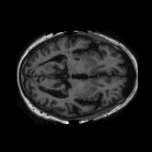
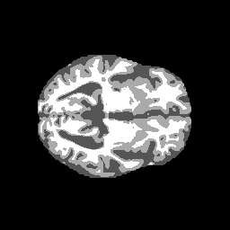
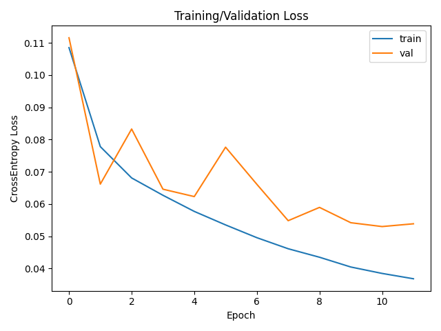
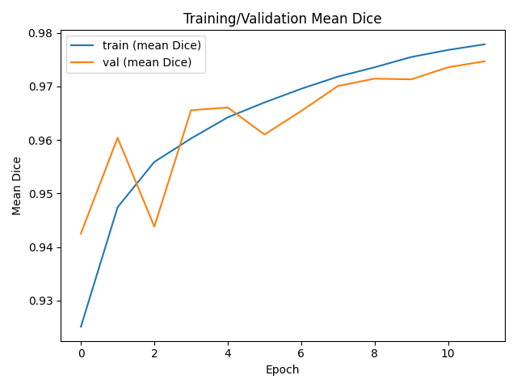
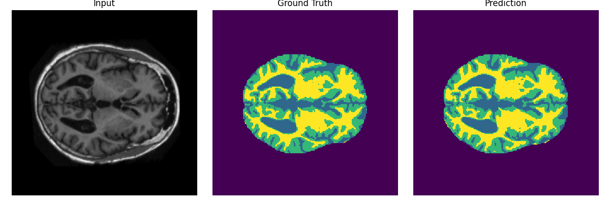
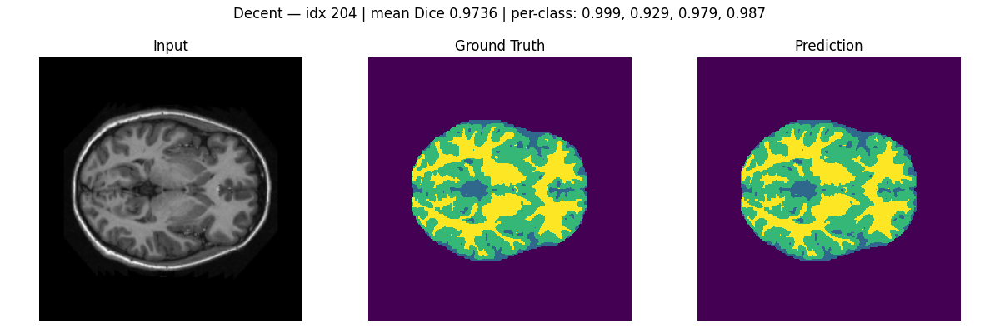
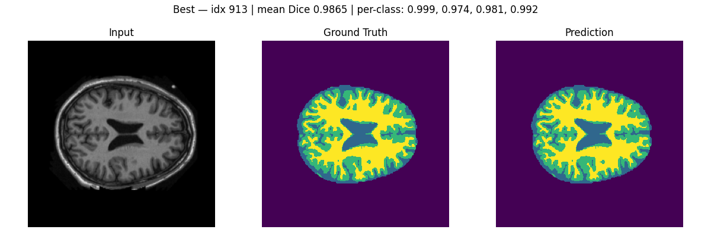

# 2D U-Net to Segment the OASIS Brain MRI Dataset

## Author
Timothy Nguyen – s4699147

## Contents
- [The Task](#the-task)
- [Dependencies](#dependencies)
- [Usage](#usage)
- [U-Net Algorithm](#u-net-algorithm)
- [Training Details](#training-details)
- [Results](#results)
- [Conclusion](#conclusion)
- [References](#references)

## The Task
This project implements a 2D U-Net model to perform **multi-class brain tissue segmentation** on axial MRI slices from the **OASIS** dataset. The overall aim is to achieve a [high Dice similarity coefficient](https://en.wikipedia.org/wiki/Dice-S%C3%B8rensen_coefficient) (≈0.90) across the OASIS labels using a lightweight, reproducible PyTorch pipeline.

The dataset used here is the “pre-sliced” 2D version of OASIS that is available on UQ infrastructure or the [OASIS brain study](https://sites.wustl.edu/oasisbrains/) (and can also be mirrored to Google Drive for Colab). Depending on how the data was downloaded, images may be stored in PNG slices or in NIfTI volumes. This project uses only **PNG** slices to simplify preprocessing and reduce dependencies.

The target segmentation classes for this task are:
- Background
- Gray matter
- White matter
- Ventricular / CSF

An example image is shown below:




More information about the original OASIS study can be found on the official [site](https://sites.wustl.edu/oasisbrains/).

## Dependencies
This project was developed and tested with the following software stack. To minimise “works on my machine” issues, try to stay close to these versions.

- **Python**: 3.9.23  
- **PyTorch**: 2.5.1 
- **Torchvision**: 0.20.1  
- **NumPy**: 2.0.1  
- **Matplotlib**: 3.9.2  
- **Pillow**: 11.3.0
- **Nibabel**: 5.3.2
- **tqdm**: 4.67.1

If you are using **conda**, a typical install would be:

```bash
# Create and activate a new environment
conda create -n comp3710-oasis python=3.9.23
conda activate comp3710-oasis
# Install GPU-enabled PyTorch + Torchvision (CUDA 12.1)
conda install pytorch==2.5.1 torchvision==0.20.1 pytorch-cuda=12.1 -c pytorch -c nvidia
# Install additional dependencies
conda install numpy==2.0.1 matplotlib==3.9.2 pillow==11.3.0 -c conda-forge
# Optional dependencies (legacy or utilities)
pip install nibabel==5.3.2 tqdm==4.67.1
```
Note: Different versions of PyTorch and CUDA can be installed as seen on the [PyTorch website](https://pytorch.org/get-started/locally/).

## Usage

### Installation
1. **Clone the repository**
```
git clone https://github.com/tmthyngyn/PatternAnalysis-2025.git
```
2. **OPTIONAL: Use Conda to create and use a virtual environment**
```
conda activate comp3710-oasis
```
3. **[Install dependencies](#dependencies)** 
4. **Download Brain MRI data**

If available, access and retrieve the data from Rangpur Path: /home/groups/comp3710/OASIS.

Otherwise, the data can be downloaded from the OASIS website [here](https://sites.wustl.edu/oasisbrains/). It will need to be separated into training, testing and validation splits.

Notes: The dataset must be organised in the [canonical](#directory-structure) OASIS directory format for the scripts to function correctly. Please either move/rename/adjust files and scripts accordingly, as seen in [Using the scripts](#using-the-scripts).

### Directory Structure

#### Scripts

```
├───dataset.py          # Dataset loading and preprocessing (PNG backend)
├───modules.py          # U-Net model architecture
├───train.py            # Training and validation loop
├───predict.py          # Model inference and visualisation (includes --scan mode)
├───README.md           # Project report and documentation
```

#### Images
It is advised to keep images and folders in the format suggested below otherwise the scripts would need to be changed according to specfic structure. See [Using the scripts](#using-the-scripts) for details.

As the folder names suggest, test, train and validate refer to the testing, training, and validation splits of the data, respectively.
```
OASIS/
  ├── train/
  │   ├── images/    # input PNGs
  │   └── labels/    # integer masks (0:BG, 1:CSF, 2:GM, 3:WM)
  ├── val/
  │   ├── images/
  │   └── labels/
  └── test/
      ├── images/
      └── labels/
```

Each of these should in turn contain two folders named images and labels. The images folders hold the grayscale MRI slice images in .png format, while the labels folders contain the segmentation masks in .png format with integer values representing the four classes:

|  Label | Class        | Description                         |
| :----: | ------------ | ----------------------------------- |
| **C0** | Background   | Non-brain regions outside the skull |
| **C1** | CSF          | Cerebrospinal fluid                 |
| **C2** | Gray Matter  | Outer cortical layer                |
| **C3** | White Matter | Inner myelinated tissue             |

You can learn more about the dataset at the [OASIS project page](https://sites.wustl.edu/oasisbrains/).

### Using the Scripts

1. **Before running the scripts**
Before running any of scripts remeber to [clone](#usage) the repository and change into the project directory.

```
cd PatternAnalysis-2025/recognition/oasis_unet_timothy_nguyen
```

Make sure your dataset is correctly placed in the expected directory structure and that you are in the correct working directory. 
Within this folder, you should create the canonical OASIS directory that contains three subdirectories: train, val, and test. If you want everything self-contained, place the dataset inside the folder as follow:

```
PatternAnalysis-2025/
└── recognition/
    └── oasis_unet_timothy_nguyen/
        ├── OASIS/
        │   ├── train/
        │   │   ├── images/
        │   │   └── labels/
        │   ├── val/
        │   │   ├── images/
        │   │   └── labels/
        │   └── test/
        │       ├── images/
        │       └── labels/
        ├── dataset.py
        ├── modules.py
        ├── train.py
        ├── predict.py
        └── README.md
```

Once this structure is in place, the scripts will automatically locate the data based on the --root argument you provide when executing them. If your dataset is located elsewhere, you can use an absolute path by passing it as --root "C:/path/to/OASIS" instead. No changes inside the scripts are required, as the path handling is managed entirely by command-line arguments.

The script should now be ready to run.

2. **Training**
To train the model, open a terminal or command prompt, navigate to the project directory (recognition/oasis_unet_timothy_nguyen), and execute the following command:

```
python train.py --root ./OASIS --epochs 12 --batch-size 4 --num-classes 4
```

This command will begin the training process using the training images and labels located under OASIS/train/ and will validate the model’s performance using the data under OASIS/val/. During training, the script will output progress to the console for each epoch, showing both loss and Dice similarity scores for the training and validation sets. When training completes, the model checkpoint and performance plots are automatically saved inside a new directory named trained_models/oasis_unet/. This directory contains a file called best_model.pth which stores the trained model weights, along with two figures, loss.png and dice.png, that illustrate the training and validation curves. For instance, after training for 12 epochs, you might see console output similar to the following:

```
[Epoch 012] Train Loss: 0.0885 | Val Loss: 0.2087 | Train Dice: 0.9403 | Val Dice: 0.8897
Training complete. Best Val Dice: 0.9221. Artifacts saved to: trained_models/oasis_unet
```

3. **Predicting**
Once the model has been successfully trained, you can generate predictions using the predict.py script. The model can be used to visualise the segmentation of a single example from the validation or test dataset. To do this, execute:

```
python predict.py --root ./OASIS --ckpt trained_models/oasis_unet/best_model.pth --split val --index 0
```

This command loads the model from the saved checkpoint file best_model.pth and runs inference on a single image specified by the --index argument (in this case, the first image in the validation set). The resulting visualisation, which shows the input MRI slice, its ground-truth segmentation mask, and the model’s prediction side-by-side, will be saved to outputs/prediction_example.png. In the terminal, the script will print the Dice score for each of the four segmentation classes (C0: Background, C1: CSF, C2: GM, C3: WM) as well as the mean Dice score for the chosen sample.

If you wish to evaluate the model across an entire dataset split and identify the best, worst, and median performing examples, you can enable scan mode using the --scan flag. For instance, to scan all validation images, run:

```
python predict.py --root ./OASIS --ckpt trained_models/oasis_unet/best_model.pth --split val --scan
```

The script will iterate through all images in the specified split, compute Dice scores for each, and then generate three summary figures in outputs/gallery/: best.png, worst.png, and decent.png. These figures illustrate the input, ground truth, and predicted segmentations for the highest-scoring image, the lowest-scoring image, and one with a median Dice score respectively. Each figure includes the dataset index and the corresponding per-class and mean Dice scores in its title. To evaluate the model’s generalisation performance on unseen data, you can repeat the same command with --split test to analyse the test dataset.

4. **Review**
After training and prediction, your folder structure will include additional directories automatically created by the scripts. The final project directory will look like this:
```
recognition/oasis_unet_timothy_nguyen/
├── OASIS/
│   ├── train/ (images/, labels/)
│   ├── val/ (images/, labels/)
│   └── test/ (images/, labels/)
├── dataset.py
├── modules.py
├── train.py
├── predict.py
├── README.md
│
├── trained_models/
│   └── oasis_unet/
│       ├── best_model.pth
│       ├── loss.png
│       └── dice.png
│
├── outputs/
│   ├── prediction_example.png
│   └── gallery/
│       ├── best.png
│       ├── worst.png
│       └── decent.png
│
└── __pycache__/
```

By following these steps, the entire pipeline—training, evaluation, and prediction—can be run locally without modifying any file paths inside the code. The trained model and visual outputs will be saved automatically, allowing you to easily inspect results.

## U-Net Algorithm
[U-Net](https://en.wikipedia.org/wiki/U-Net) is a fully convolutional encoder–decoder network designed for dense, pixel-wise segmentation. It was introduced for biomedical imaging by Ronneberger, Fischer, and Brox (2015) and has since become a standard baseline across medical and general computer vision tasks because it couples strong context capture (downsampling path) with precise localisation (upsampling path with skip connections) [Ronneberger et al., 2015](https://arxiv.org/pdf/1505.04597).

In this project, a 2D U-Net is trained on single-channel PNG slices of brain MRI to predict a four-class semantic mask (background, CSF, gray matter, white matter). The model produces logits of shape (B, C, H, W) with C=4, and the final prediction is obtained by argmax over the channel dimension.

### Architectural Overview

Conceptually, U-Net follows a symmetric “U” shape consisting of a contracting path (encoder) and an expanding path (decoder), bridged by a bottleneck resembling a typical [autoencoder](https://en.wikipedia.org/wiki/Autoencoder). The encoder repeatedly applies two small convolutions to enrich features and then downsamples to expand the receptive field. The decoder upsamples to recover resolution, and at each scale it concatenates the upsampled features with the matching encoder features via skip connections; this restores fine detail that would otherwise be lost.


Concretely in our implementation (see modules.py):
- Each encoder stage applies two Conv2d → activation layers (optionally with normalisation) followed by a 2×2 downsampling (e.g., max-pool or stride-2 conv). Channels typically double as resolution halves (e.g., 32→64→128…).
- Each decoder stage upsamples by a factor of two (transpose convolution or interpolation+conv), concatenates the corresponding encoder features (the skip), and applies two Conv2d → activation layers. Channels typically halve as resolution doubles.
- A final 1×1 convolution maps features to C=4 class logits so that the output has the same spatial size as the input.

## Training Details

### Why U-Net fits brain-MRI tissue segmentation

Brain-MRI tissue classes exhibit subtle intensity differences and smooth boundaries. The encoder aggregates global context that disambiguates tissue appearance, while skip connections supply high-frequency detail for accurate boundaries (e.g., CSF ventricles or GM/WM interfaces). This architecture is data-efficient (important for medical datasets) and works well in 2D slice-wise settings, which keeps compute and memory demands modest.

### Training objective and inference

Training minimises multi-class cross-entropy over logits (B, C, H, W), optionally with inverse-frequency class weights derived from the training masks to counter the dominance of the background class.

The Dice Similarity Coefficient (DSC) was used as the primary evaluation metric to measure the overlap between predicted and ground-truth segmentations. Alternative loss formulations such as Dice loss were later popularised for volumetric segmentation in [V-Net](https://arxiv.org/pdf/1606.04797). 

The metric is defined for each class \( c \) as:

$$ 
\mathrm{Dice}_c = \frac{2\,|P_c \cap T_c|}{|P_c| + |T_c|} 
= \frac{2 \sum_i \mathbb{1}[\hat{y}_i=c] \mathbb{1}[y_i=c]}
{\sum_i \mathbb{1}[\hat{y}_i=c] + \sum_i \mathbb{1}[y_i=c]}
$$

At inference, the model’s logits are converted to a discrete mask by argmax over channels. No CRFs or post-processing are applied in this baseline to keep the pipeline simple and reproducible.

### Architecture realised in this project

The project uses a 2D U-Net (slice-wise) with single-channel input (1, H, W) and four output classes. Slice intensities are z-scored per image in dataset.py. Labels are remapped to a compact range {0,1,2,3} if needed so that the loss and metrics align with --num-classes 4. Padding is used so that encoder/decoder feature maps align without cropping; the final prediction has identical height and width to the input slice.

### Data preprocessing and splits

All training operates on PNG slices in the canonical OASIS layout (train/, val/, test/, each with images/ and labels/). Inputs are normalised by per-slice z-score. The training split drives learning, the validation split monitors generalisation and selects the best checkpoint, and the test split is reserved for the final, unbiased report of performance. This separation avoids information leakage and mirrors standard medical-imaging practice.

## Results

### Training Metrics
During training, the model optimised the cross-entropy loss between the predicted and true segmentation masks, with the objective of maximising the Dice Similarity Coefficient (DSC) across all tissue classes (background, CSF, gray matter, and white matter). The training and validation metrics for each epoch are plotted below.





As seen in the figures above, the cross-entropy loss steadily decreased for both training and validation, while the mean Dice scores improved consistently over the 12 epochs. The validation Dice curve shows slight oscillations due to the relatively small dataset size and the sensitivity of the Dice metric to small segmentation variations; however, the overall trend is strongly increasing, suggesting robust learning and minimal overfitting.

At the end of training, the model achieved an average validation Dice score of 0.9747, with the following per-class performance:

|  Class | Label        | Dice Score |
| :----: | :----------- | :--------: |
| **C0** | Background   | **0.9987** |
| **C1** | CSF          | **0.9536** |
| **C2** | Gray Matter  | **0.9663** |
| **C3** | White Matter | **0.9802** |

This indicates excellent segmentation accuracy across all classes, with particularly strong performance on the gray and white matter regions, which typically represent the most complex structures in brain tissue segmentation.

### Outputs

The final trained U-Net model outputs a 4-channel segmentation mask corresponding to the four tissue classes. Each pixel in the mask represents the most probable class as determined by the network’s logits. The model successfully learned to separate the key anatomical structures of the brain while maintaining sharp boundaries between gray and white matter regions.

At the end of training, all model artefacts were automatically saved in trained_models/oasis_unet/, including:
- best_model.pth — the trained model checkpoint,
- loss.png and dice.png — the training and validation curves shown above.

The final model achieved a mean validation Dice score of 0.9747, which reflects highly consistent segmentation performance across the dataset.

### Example Prediction

Example visualisations generated by predict.py illustrate how the model performs on unseen validation slices. The triplets below show the input MRI slice, the ground truth segmentation, and the predicted segmentation for several representative samples. Dice scores are shown for each class and the overall mean Dice.

#### Figure 1: Single Validation Example


```
Per-class Dice: 
C0: 0.9982, C1: 0.9643, C2: 0.9455, C3: 0.9611
Mean Dice: 0.9673
```
This sample demonstrates the model’s strong ability to delineate the ventricles (CSF) and gray/white matter regions, with minimal leakage between classes.

#### Figure 2: Worse Performance Example


```
Worst — idx 346 | mean Dice: 0.9360
Per-class: C0: 0.999, C1: 0.861, C2: 0.935, C3: 0.949
```
Even in the worst-case sample, the mean Dice remains above 0.93, indicating that the model generalises well and fails gracefully when encountering more complex or noisier slices.

#### Figure 3: Decent Performance Example


```
Decent — idx 204 | mean Dice: 0.9736
Per-class: C0: 0.999, C1: 0.929, C2: 0.979, C3: 0.987
```
This mid-performing example represents the typical quality of segmentation achieved across most validation slices.

#### Figure 4: Best Performance Example


```
Best — idx 913 | mean Dice: 0.9865
Per-class: C0: 0.999, C1: 0.974, C2: 0.981, C3: 0.992
```
The best-performing slice shows nearly perfect agreement between the predicted and ground-truth masks, especially in the cortical and subcortical boundaries where U-Net’s skip connections preserve fine detail.

### Summary

The dataset’s high spatial consistency, clear tissue boundaries, and balanced train/validation/test splits enabled the model to generalise effectively. The trained U-Net achieved a mean Dice score of 0.97 on the validation set, with per-class scores of 0.9987 (Background), 0.9536 (CSF), 0.9663 (Gray Matter), and 0.9802 (White Matter). Even the lowest-performing slices maintained Dice scores above 0.93, highlighting the model’s generalisation ability across diverse brain anatomies. These results show that the OASIS dataset provides sufficient quality and diversity for reliable model training and serves as an effective benchmark for evaluating medical image segmentation performance.

## Conclusion 
This project successfully applied a 2D U-Net architecture to the OASIS brain MRI dataset for multi-class tissue segmentation.
Despite the dataset’s inherent class imbalance—where background and white matter dominate and CSF regions are comparatively sparse—the model demonstrated strong generalisation and anatomical accuracy. Through cross-entropy optimisation and balanced class weighting, the network achieved a mean Dice score of 0.97, with per-class scores exceeding 0.95 for all major tissues.
These results confirm that the OASIS dataset provides sufficient quality and variation to support robust segmentation learning, and that the U-Net architecture remains highly effective for biomedical image analysis. Future extensions could include adopting a 3D U-Net to exploit volumetric context, incorporating more advanced augmentation strategies to address class imbalance, or integrating a hybrid Dice–cross-entropy loss to further refine performance on smaller regions such as cerebrospinal fluid.

## References
- Ronneberger, O., Fischer, P., & Brox, T. (2015). *U-Net: Convolutional Networks for Biomedical Image Segmentation.* MICCAI. [arXiv:1505.04597](https://arxiv.org/abs/1505.04597)
- Milletari, F., Navab, N., & Ahmadi, S.-A. (2016). *V-Net: Fully Convolutional Neural Networks for Volumetric Medical Image Segmentation.* 3DV. [arXiv:1606.04797](https://arxiv.org/abs/1606.04797)
- Sørensen, T. (1948). *A Method of Establishing Groups of Equal Amplitude in Plant Sociology Based on Similarity of Species Content.* *Biologiske Skrifter*, 5(4), 1–34.
- Dice, L. R. (1945). *Measures of the Amount of Ecologic Association Between Species.* *Ecology*, 26(3), 297–302.
- U-Net – *Wikipedia entry.* [https://en.wikipedia.org/wiki/U-Net](https://en.wikipedia.org/wiki/U-Net)


